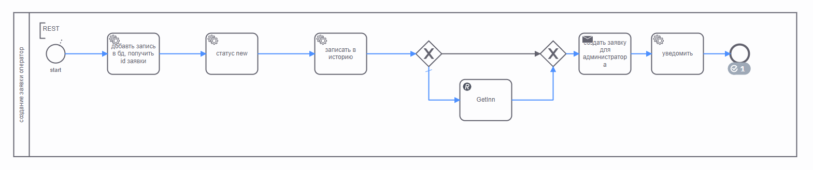
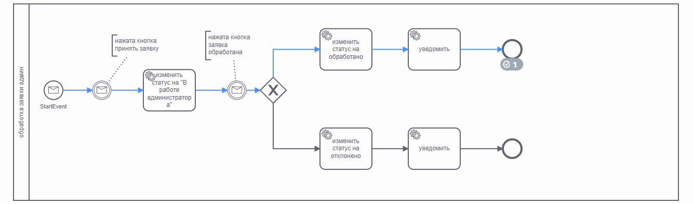

Процесс реализовани на пример двух схем по движению заявки:
1.Создание заявки

2.Обработка администратором

### step 1:
curl --location 'http://localhost:8080/start' \
--header 'Content-Type: application/json' \
--data '{
"numberBid":"fgh",
"comment":"fgj",
"statusBid":null,
"idClient":111,
"inn":1234567890,
"flag":true
}'

### step 2:
curl --location 'http://localhost:8080/accept/{inn} (replace with the one obtained from the rest template)

### step 3:
curl --location 'http://localhost:8080/processed/{inn} (replace with the one obtained from the rest template)